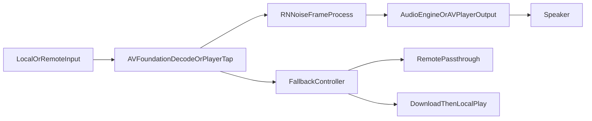

# VoiceClear

> 基于 RNNoise 神经网络的音视频人声降噪工具，支持 macOS 和 iOS 双平台。

VoiceClear 是一款原生 Apple 平台应用，使用 **RNNoise**（Recurrent Neural Network Noise Suppression）进行语音降噪。项目目前采用 **AVFoundation 真流式 + 多级回退** 技术方案，在低延迟播放、在线可用性与兼容性之间做平衡。当前版本已完成本轮音频连续性修复：在线流式重音/拖音明显下降，本地流式爆破音得到抑制。

详细技术文档见：`docs/TECHNICAL_SOLUTION.md`

## 功能特性

- **音频降噪**：支持 MP3、M4A、WAV、AAC、AIFF、FLAC
- **视频降噪**：支持 MP4、MOV（视频轨直通，处理音轨）
- **真流式播放降噪**：增量解码 + RNNoise 小帧处理（已做连续性优化）
- **在线 URL 播放**：HTTP/HTTPS MP3/MP4，优先实时降噪
- **多级回退**：Tap 失败 -> 在线原声 -> 下载后本地播放
- **强度可调**：10% ~ 100%

## 技术方案总览

### 1) 本地播放主路径（默认）

`IncrementalStreamingDenoiser`

- 增量读取/解码音频小块 PCM
- 按 RNNoise 帧（480 samples）持续降噪
- 输出到 `AudioEnginePlayer` 调度播放
- 目标：降低首帧等待、降低内存峰值

### 2) 在线播放主路径（当前可用）

`AVPlayerItem + MTAudioProcessingTap`

- 在线媒体直接播放
- 在音轨处理回调中执行 RNNoise
- 采用“跨回调样本连续拼接”（`sourcePendingSamples`）替代逐包固定长度重映射，避免拖音/重音
- 对回调包边界做平滑过渡，降低不连续导致的突变噪声
- 目标：实现在线“边播边降噪”

### 2.2) 本轮音频连续性修复（2026-02）

- **在线流式链路**：修复重采样后逐包重映射导致的时间轴拉伸，改为连续样本消费模型
- **本地流式链路**：在 `IncrementalStreamingDenoiser` 增加降噪块边界平滑，抑制人声段爆破音
- **结果**：同源音频下，在线重音显著降低；本地轻微重音与爆破音明显改善

### 2.1) 在线流式音质说明（重要）

- 在线流式与离线整文件降噪在理论上不完全等价：
  - 流式路径受实时性约束，无法像离线处理一样使用完整全局上下文
  - 在线路径还需处理回调块边界、缓冲和时序抖动
- 因此实际效果通常为：**流式可接近离线，但离线仍是音质上限**
- 产品策略建议：
  - 低延迟优先：使用在线流式降噪
  - 最高音质优先：使用下载后本地（离线）降噪/播放

### 3) 可用性回退路径

- AudioTap 不可用 -> 在线原声播放
- 在线初始化失败 -> 下载到本地后播放
- 目标：优先保证用户“能播、不断播”

### 4) 关键观测指标

- 首帧时间（Startup Latency）
- 缓冲时长与卡顿次数（Buffer/Stall）
- 回退原因（Tap 挂载失败、远端初始化失败等）
- 长时播放稳定性（连续播放成功率）

## 播放数据流



## 项目结构（核心）

```text
VoiceClear/
├── VoiceClearApp.swift
├── ContentView.swift
├── Models/
│   └── AudioFileItem.swift
├── ViewModels/
│   ├── AudioViewModel.swift
│   └── PlayerViewModel.swift
├── Services/
│   ├── StreamingAudioPipeline.swift
│   ├── IncrementalStreamingDenoiser.swift
│   ├── StreamingDenoiser.swift
│   ├── AVPlayerDenoiseTapProcessor.swift
│   ├── AVAssetAsyncLoader.swift
│   ├── AudioEnginePlayer.swift
│   ├── AudioFileService.swift
│   ├── RNNoiseProcessor.swift
│   └── FFmpegDenoiser.swift
└── Views/
    ├── DenoisePlayerView.swift
    ├── VideoPlayerView.swift
    └── FileConversionView.swift
```

## 架构说明

### MVVM 分层

- `AudioViewModel`：批处理降噪与导出流程
- `PlayerViewModel`：实时播放、seek、回退策略、运行指标
- `Services`：解码/重采样/降噪/播放调度/在线处理

### 核心模块职责

- `StreamingAudioPipeline`：统一流式 PCM 读取协议
- `IncrementalStreamingDenoiser`：本地流式主实现
- `StreamingDenoiser`：legacy 兼容实现（回退）
- `AVPlayerDenoiseTapProcessor`：在线音轨实时降噪
- `AudioEnginePlayer`：AVAudioEngine 播放与缓冲池优化
- `AVAssetAsyncLoader`：iOS 16+ 异步 `loadTracks/load(.duration)` 封装

## 技术栈

- 平台：macOS / iOS (SwiftUI)
- 语言：Swift 5（兼容 Swift 6 并发检查）
- 架构：MVVM
- 降噪引擎：RNNoise C 库（编译进二进制）
- 音视频处理：AVFoundation + AVPlayerItem AudioTap
- 并发模型：Swift Concurrency + GCD
- 状态管理：Observation (`@Observable`)

## 运行环境

- macOS 15.0+ / iOS 18.0+
- Xcode 16.0+

## 设计亮点

| 决策         | 说明                                         |
| ------------ | -------------------------------------------- |
| 真流式优先   | 本地增量流式 + 在线实时处理                  |
| 多级回退     | 优先可用性，失败自动降级                     |
| 音质分层     | 实时流式满足低延迟，离线处理作为最高音质上限 |
| Swift 6 兼容 | 处理 Sendable、主线程隔离、异步等待告警      |
| 视频轨直通   | 保持画质并减少重编码开销                     |

## 支持格式

- 音频：MP3, M4A, WAV, AAC, AIFF, FLAC  
  输出：WAV (16kHz Mono Float32)
- 视频：MP4, MOV  
  输出：原格式（视频无损 + 处理后音轨）

## 许可证

本项目基于 [GNU General Public License v3.0](LICENSE) 开源。
