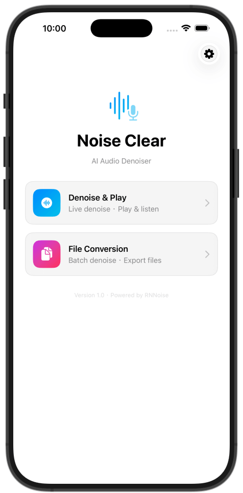
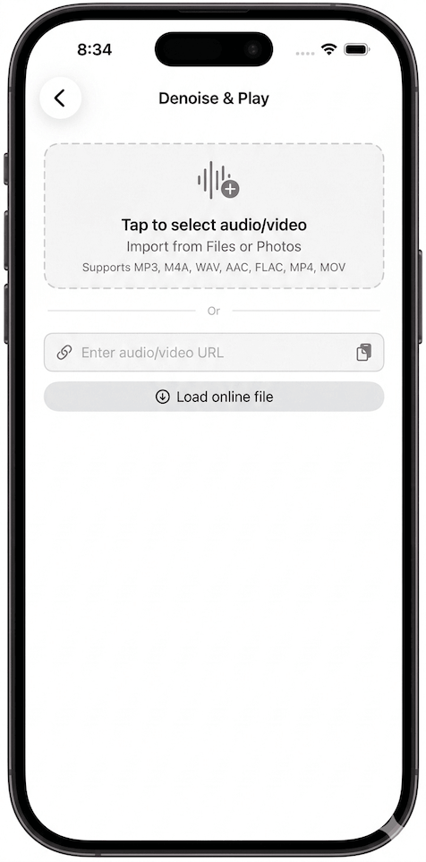
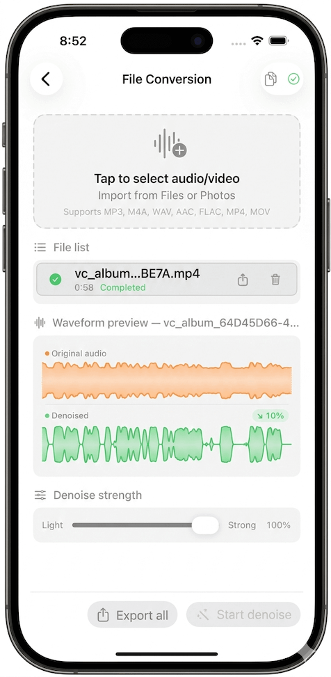

# NoiseClear

> 面向 iOS / macOS 的原生音视频人声降噪应用，基于 RNNoise 提供本地流式播放、在线播放实时降噪与离线批处理能力。

NoiseClear 是一个围绕 Apple 平台媒体栈实现的实时音频处理项目。在 SwiftUI + AVFoundation 的原生体系内，将 RNNoise 接入本地播放、远端 URL 播放、离线文件处理三类场景，并处理启动时延、长时稳定性、样本连续性、回退可用性与跨平台维护等问题。

## 界面预览

| 首页 | 播放 | 批量处理 |
| --- | --- | --- |
|  |  |  |

## 实现概览

### 1. 双链路实时降噪架构

NoiseClear 将实时播放拆分为两条链路：

- 本地链路：`IncrementalStreamingDenoiser + AudioEnginePlayer`
- 在线链路：`AVPlayerItem + MTAudioProcessingTap + AVPlayerDenoiseTapProcessor`

拆分后的处理方式如下：

- 本地文件走增量解码与缓冲策略，便于控制启动速度与降噪连续性
- 远端媒体复用 `AVPlayer` 的在线播放能力，在系统播放器链路上接入实时降噪
- 两条链路分别处理本地 IO 与远端流媒体的约束

### 2. 本地流式降噪

本地播放主路径采用持续增量读取媒体、输出 PCM 小块、按 RNNoise 帧长逐帧处理，再交给 `AudioEnginePlayer` 播放。

关键工程点：

- 以小块增量读取替代全量解码，缩短首帧等待时间
- 统一到目标采样格式后按 `480 samples` 对齐 RNNoise 帧处理
- 管线内控制缓冲水位，避免过度缓存带来的启动拖延与内存浪费
- 在块边界做平滑处理，降低爆破音、突变感和边界失真

这条链路主要关注播放连续性、调试可行性与后续维护成本。

### 3. 基于 Audio Tap 的在线播放实时降噪

对 `http/https` 远端资源，NoiseClear 优先走 `AVPlayer + MTAudioProcessingTap` 链路，在系统原生在线播放能力上直接插入音轨处理。

这条链路主要包含以下处理：

- 不需要先下载整个文件再处理
- 在 Tap 回调中完成单声道转换、RNNoise 处理与多声道回写
- 通过 `rnPendingSamples` 与 `sourcePendingSamples` 维持跨回调连续样本消费
- 避免把每次回调都当作独立音频包处理，减少拖音、重音和时间轴抖动
- 增加回调边界平滑，提升长时听感稳定性

这部分处理的是系统播放器驱动下的连续音频流，对样本衔接和回调边界稳定性要求较高。

### 4. 面向真实使用场景的多级回退策略

为降低链路失败对播放的影响，项目实现了分级回退：

1. 在线 Audio Tap 实时降噪
2. Tap 挂载失败时回退到在线原声播放
3. 远端初始化失败时下载到本地，再走本地降噪链路

同时记录 `playbackMetrics.fallbackReason` 和启动耗时指标，便于排查问题和后续调整。

### 5. 离线批处理与实时链路并存

除了实时播放，NoiseClear 还提供基于 `FFmpegDenoiser` 的离线批量处理能力：

- 音频导出为 `WAV (16kHz / mono / Float32)`
- 视频保持原容器，视频轨直通，仅重写降噪后的音轨
- 支持批量处理、进度反馈、失败重试、导出分享
- 新增处理中止能力，可停止当前文件并阻止后续任务继续推进

这部分对应实时监听与批量处理输出两类使用场景。

### 6. 导入体验与异步媒体加载的工程优化

针对大文件导入、`mp4/mov` 读取与波形生成的性能问题，项目做了多项针对性优化：

- 导入链路改为“两阶段导入”：先快速入列占位项，再后台补全时长与波形
- 导入期间允许取消，避免长时间不可控等待
- 对 `AVAsset` 的异步属性加载做稳定性治理，降低 `duration/tracks` 获取失败与超时风险
- 收敛后台处理与主线程 UI 写回边界，减轻界面卡顿

这些优化主要用于降低导入等待感和界面卡顿。

### 7. 本地化体系

项目的多语言支持包含以下组成部分：

- 稳定 key 定义在 `L10nKey`
- UI 文案统一通过 `L10n.text(...)` / `L10n.string(...)` 访问
- `LocalizationConfig` 维护支持语言与 fallback 策略
- `LanguageSettings` 负责运行时语言切换与持久化
- 缺失翻译统一回退到 `en`，并输出可追踪的缺失标记

这样可以在功能迭代时保持文案入口和语言配置的一致性。

## 核心架构

### MVVM + 服务层解耦

- `Views/`：SwiftUI 页面与交互入口
- `ViewModels/`：业务状态机、异步流程编排、链路选择
- `Services/`：解码、降噪、播放调度、媒体 IO、导出处理
- `Localization/`：多语言 key、访问入口与语言配置

核心职责分布：

- `PlayerViewModel`：管理播放状态机、本地/远端链路选择、回退策略、启动延迟指标
- `AudioViewModel`：管理批量文件导入、预处理、离线降噪、导出与中断
- `IncrementalStreamingDenoiser`：本地流式降噪主实现
- `AVPlayerDenoiseTapProcessor`：在线播放音轨实时降噪核心
- `AudioEnginePlayer`：基于 `AVAudioEngine` 的播放与缓冲调度
- `FFmpegDenoiser`：离线批处理入口
- `AVAssetAsyncLoader`：媒体属性异步加载与稳定性处理

### 播放控制中枢

`PlayerViewModel` 是播放能力的统一入口，负责：

- 区分本地文件与远端 URL 的主链路
- 管理播放、暂停、停止、seek 等状态变迁
- 使用 `activePlaybackToken` 避免异步播放请求竞争
- 记录 `startupLatencyMs`、`fallbackReason` 等关键指标

这样可以让 UI 层保持相对轻量，并将媒体链路控制集中在同一入口。

## 处理链路细节

### 本地链路流程

本地流式降噪的主要流程如下：

1. `IncrementalStreamingDenoiser` 按小块增量读取输入媒体
2. 统一转换到目标采样格式
3. 按 RNNoise 帧长 `480 samples` 执行逐帧降噪
4. 转为输出格式后交由 `AudioEnginePlayer` 调度播放

为维持播放连续性，链路内部会维护块边界状态，并在必要时对开头片段执行短淡入平滑，以降低边界突变带来的爆破感和轻微失真。

缓冲策略方面，当前实现会控制内部队列上限，并在播放前执行小预缓冲。本地读取循环根据缓冲水位持续填充数据，用于平衡启动延迟和播放稳定性。

### 在线链路流程

在线实时降噪的主要流程如下：

1. `AVPlayerItem` 建立在线播放
2. `MTAudioProcessingTap` 挂载音轨处理回调
3. 回调中统一为 mono，执行 RNNoise，再写回多声道
4. `AVPlayer` 直接输出处理后的音频

在线流源的采样率可能与 RNNoise 固定采样率不同，当前实现使用双向转换：

- `toRNConverter`：源采样率到 RNNoise 采样率
- `fromRNConverter`：RNNoise 采样率到源采样率

为避免每次回调彼此割裂，链路会保留跨回调的待处理样本：

- `rnPendingSamples`：用于维持 RNNoise 帧对齐
- `sourcePendingSamples`：用于重采样后的连续出样
- `applyBoundarySmoothingIfNeeded`：用于边界平滑

### 并发与线程模型

- `PlayerViewModel` 运行在 `@MainActor`，用于保持 UI 状态一致
- 本地读取循环由独立 `DispatchQueue` 驱动
- `ReadLoopController` 通过锁保护运行状态
- 管线实现按 `Sendable` 约束组织，降低并发读写风险

## 支持能力

- 输入音频：`mp3`、`m4a`、`wav`、`aac`、`aiff`、`flac`
- 输入视频：`mp4`、`mov`
- 在线 URL：`http` / `https`
- 平台：`iOS 17+`、`macOS 14+`
- 多语言：`zh-Hans`、`zh-Hant`、`en`、`ja`

## 项目结构

```text
NoiseClear/
├── NoiseClearApp.swift
├── ContentView.swift
├── Localizable.xcstrings
├── Localization/
│   ├── L10nKey.swift
│   ├── L10n.swift
│   └── LocalizationConfig.swift
├── Models/
│   ├── AudioFileItem.swift
│   └── LanguageSettings.swift
├── ViewModels/
│   ├── AudioViewModel.swift
│   └── PlayerViewModel.swift
├── Services/
│   ├── StreamingAudioPipeline.swift
│   ├── IncrementalStreamingDenoiser.swift
│   ├── StreamingDenoiser.swift
│   ├── AVPlayerDenoiseTapProcessor.swift
│   ├── AVAssetAsyncLoader.swift
│   ├── AudioEnginePlayer.swift
│   ├── AudioFileService.swift
│   ├── RNNoiseProcessor.swift
│   └── FFmpegDenoiser.swift
└── Views/
    ├── DenoisePlayerView.swift
    ├── VideoPlayerView.swift
    ├── FileConversionView.swift
    ├── FileListView.swift
    ├── DropZoneView.swift
    ├── WaveformView.swift
    └── SettingsDrawerView.swift
```

## 技术栈

- UI：SwiftUI
- 架构：MVVM + Observation (`@Observable`)
- 媒体处理：AVFoundation / AVPlayer / MTAudioProcessingTap / AVAudioEngine
- 降噪引擎：RNNoise C library
- 离线处理：FFmpeg
- 并发：Swift Concurrency + GCD

## 构建与开发

打开工程：

```bash
open NoiseClear.xcodeproj
```

命令行构建：

```bash
xcodebuild -project NoiseClear.xcodeproj -scheme NoiseClear -configuration Debug build
```

静态分析：

```bash
xcodebuild -project NoiseClear.xcodeproj -scheme NoiseClear analyze
```

本地化检查：

```bash
./scripts/l10n_audit.sh
```

构建号递增：

```bash
./scripts/bump_build_number.sh
./scripts/bump_build_number.sh 3
```

## 工程关注点

这个项目主要关注的是，如何将对输入格式、采样率、系统播放器行为、实时性和稳定性较为敏感的音频算法，接入 Apple 平台的实际媒体链路。当前实现主要处理以下问题：

- 实时播放与降噪处理之间的时延平衡
- 在线流媒体处理中的连续样本消费与回调边界稳定性
- 本地/远端链路差异下的架构拆分与统一调度
- 音频效果链路失败时的产品可用性回退
- 大文件导入、批处理取消与媒体属性异步加载的交互体验问题
- 多语言与产品化细节在持续演进中的可维护性

## 质量与维护

当前版本持续关注以下指标：

- 首帧延迟 `startupLatencyMs`
- 回退率及回退原因分布
- 长时播放稳定性
- 音频连续性的主观听感问题，例如重音、拖音、爆破音

后续仍可继续完善的方向包括：

- 将本地读取循环从轮询进一步演进为事件驱动
- 细化在线流兼容矩阵，例如编码、采样率、声道布局
- 将边界平滑阈值和窗口长度做参数化，支持更细的设备与内容调节

## 最近调整

### 2026 Q1

- 文件导入链路调整为两阶段模型：先快速创建占位项，再后台补全时长、音频数据与波形采样，以减少导入阶段的阻塞感
- 批量降噪增加中断能力，支持停止当前文件并阻止后续任务继续推进；取消后当前项回到可重试状态
- 针对 `AVAsset` 的 `duration` 和 `tracks(audio)` 读取超时问题，补充了异步加载稳定性治理与调试日志
- 新增文案继续沿用现有本地化体系，通过 `L10nKey`、`Localizable.xcstrings` 和 `L10n` 统一维护

## 许可证

本项目基于 [GNU General Public License v3.0](LICENSE) 开源。
